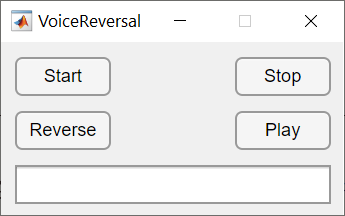

# Voice Reversal Challenge

This is a voice reversal game implemented with MATLAB R2020b.

# 倒放挑战

这是一个使用 MATLAB R2020b 实现的『录音倒放』的 GUI 小软件。

想玩这个游戏的小伙伴，可以参考这个[下饭视频](https://www.bilibili.com/video/BV1RJ411z7DX)。

## GUI

### 使用方法

1. 使用 MATLAB 打开该项目，运行 `.m` 文件，或者运行 `.mlapp` 文件，就会出现上述的 GUI 界面。
2. 点击 `Start` 按钮，开始录音
3. 点击 `Stop` 按钮，结束录音，数据存储在内存中
4. 点击 `Reverse` 将内存中的数据进行反转
5. 点击 `Play` 将播放内存中的声音数据
